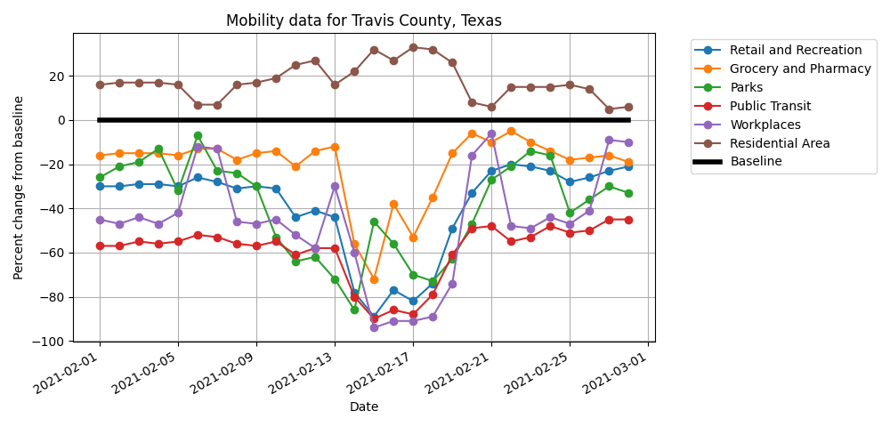

# pandemic-mobility-data

This repository contains the source code for a front-end API for a subset of Google's [COVID-19 Mobility Report](https://www.google.com/covid19/mobility/). The subset contains only data for the United States, and contains data from 2/15/2020 to 4/30/2021. From Google's [overview](https://support.google.com/covid19-mobility/answer/9824897?hl=en&ref_topic=9822927):

## About the data

> The data shows how visitors to (or time spent in) categorized places change compared to our baseline days. A baseline day represents a normal value for that day of the week. The baseline day is the median value from the 5‑week period Jan 3 – Feb 6, 2020.
>
>For each region-category, the baseline isn’t a single value—it’s 7 individual values. The same number of visitors on 2 different days of the week, result in different percentage changes. 
>
>To help you track week-to-week changes, the baseline days never change. These baseline days also don't account for seasonality. For example, visitors to parks typically increase as the weather improves.

The files in this repository can be used to build three separate Docker containers: a [front-end Flask API](), a [Redis database](), and a [Python worker node](). These three Docker containers can then be deployed using either the provided `docker-compose` file or Kubernetes configuration files.

The worker node generates a downloadable graph that shows changes in mobility due to the COVID-19 Pandemic. This graph can be customized to different date ranges, locations (county, statewide, or nationwide), and travel-type (Retail/Recreation, Grocery/Pharmacy, Parks, Public Transit, Workplaces, and Residential Areas).



## Deployment Instructions

### Docker-compose

To deploy the API using `docker-compose`, navigate into the root directory of this repository and run the following:

```
make compose-up
```

### Kubernetes

Do the following to deploy the API to a Kubernetes cluster. 

## Using the API

### CRUD operations

`/create` - POST request with a list of the JSON objects to add. All fields are required (see about the data). Store the datapoints to be added in a `json` file, then hit the endpoint as shown below.

Add three datapoints from `examples/create-example.json` (this is fake data, do not actually use for anything!):
```
$ curl -X POST -H 'content-type: application/json' -d @./examples/create-example.json localhost:5013/create

3 rows added
```

`/read/<date>/<state>?county=<county>` - GET request for a particular day and location. Date is in the form `YYYY-MM-DD`. Use `USA` for aggregate nationwide data. County is optional. 

Check that the three fake datapoints were added:
```
$ curl localhost:5013/read/2021-05-01/USA 
{
  "date": "2021-05-01", 
  "grocery_and_pharmacy_percent_change_from_baseline": "-19", 
  "parks_percent_change_from_baseline": "-33", 
  "residential_percent_change_from_baseline": "14", 
  "retail_and_recreation_percent_change_from_baseline": "-29", 
  "sub_region_1": "", 
  "sub_region_2": "", 
  "transit_stations_percent_change_from_baseline": "-49", 
  "workplaces_percent_change_from_baseline": "-37"
}
$ curl localhost:5013/read/2021-05-02/New%20York
{
  "date": "2021-05-02", 
  "grocery_and_pharmacy_percent_change_from_baseline": "-15", 
  "parks_percent_change_from_baseline": "-25", 
  "residential_percent_change_from_baseline": "13", 
  "retail_and_recreation_percent_change_from_baseline": "-26", 
  "sub_region_1": "New York", 
  "sub_region_2": "", 
  "transit_stations_percent_change_from_baseline": "-45", 
  "workplaces_percent_change_from_baseline": "-36"
}
$ curl localhost:5013/read/2021-05-01/Texas?county=Travis%20County
{
  "date": "2021-05-01", 
  "grocery_and_pharmacy_percent_change_from_baseline": "-32", 
  "parks_percent_change_from_baseline": "-36", 
  "residential_percent_change_from_baseline": "27", 
  "retail_and_recreation_percent_change_from_baseline": "-41", 
  "sub_region_1": "Texas", 
  "sub_region_2": "Travis County", 
  "transit_stations_percent_change_from_baseline": "-52", 
  "workplaces_percent_change_from_baseline": "-75"
}
```

`/update` POST request with a list of JSON objects to add. `sub_region_1`, `sub_region_2`, and `date` are required. 

Update the three fake datapoints:
```
$ curl -X POST -H 'content-type: application/json' -d @./examples/update-example.json localhost:5013/update
3 rows updated
```

You can verify that the three datapoints were updated using the `/read` endpoint.

`/delete/<date>/<state>?county=<county>` GET request to delete a datapoint. Same parameters as `/read`

Delete the three fake datapoints:
```
$ curl localhost:5013/delete/2021-05-01/USA
__2021-05-01 deleted
$ curl localhost:5013/delete/2021-05-02/New%20York
New York__2021-05-02 deleted
$ curl localhost:5013/delete/2021-05-01/Texas?county=Travis%20County
Texas_Travis County_2021-05-01 deleted
```